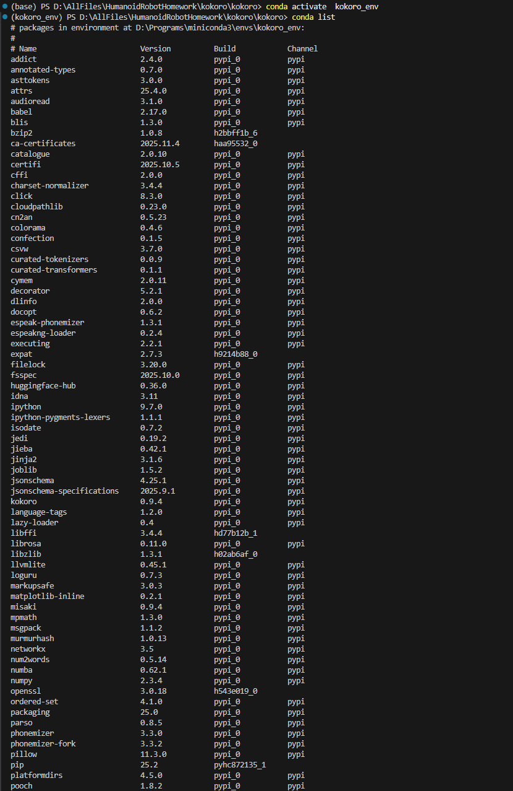
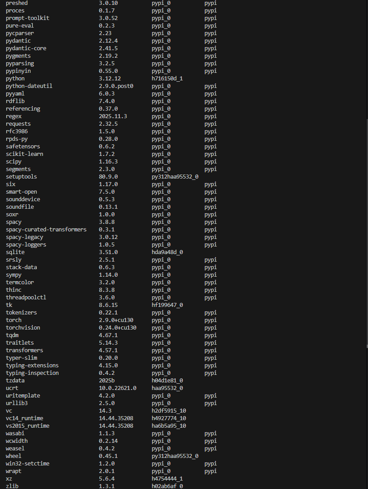
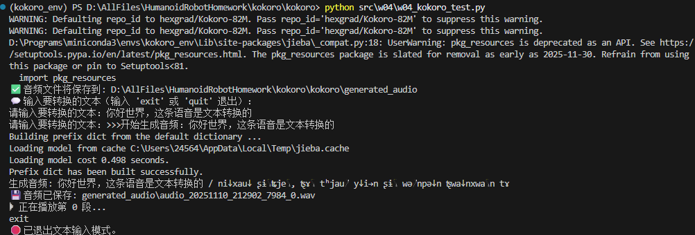

# 第四周：机器人语音识别与语音合成

## 一、kokoro语音生成

### 1. 运行虚拟环境
  
  
*图1：虚拟环境配置信息*

---

### 2. 运行代码
```python
import os
import queue
import threading
import datetime

from kokoro import KPipeline, KModel
from IPython.display import display, Audio
import soundfile as sf
import sounddevice as sd
import torch
from kokoro.istftnet import Generator


class AudioGenerator:
    def __init__(self, save_audio=True, output_dir="generated_audio"):
        self.config_path = "D:/AllFiles/HumanoidRobotHomework/kokoro/kokoro/model/kokoro82m/config.json"
        self.model_path = "D:/AllFiles/HumanoidRobotHomework/kokoro/kokoro/model/kokoro82m/kokoro-v1_0.pth"
        self.kmodel = KModel(config=self.config_path, model=self.model_path)
        self.pipeline = KPipeline(lang_code='z', device='cpu')
        self._play_pause_event = threading.Event()
        self._generate_pause_event = threading.Event()
        self._stop_event = threading.Event()
        self.text_queue = queue.Queue()
        self.audio_queue = queue.Queue()
        
        # 新增：保存音频相关设置
        self.save_audio = save_audio
        self.output_dir = output_dir
        if self.save_audio:
            os.makedirs(self.output_dir, exist_ok=True)
            print(f"✅ 音频文件将保存到: {os.path.abspath(self.output_dir)}")

    def generate_audio(self):
        while not self._stop_event.is_set():
            # 如果文本队列为空，则等待
            if self.text_queue.empty():
                self._generate_pause_event.clear()
            self._generate_pause_event.wait()

            text = self.text_queue.get()
            print(f">>>开始生成音频：{text}")
            
            # 为每个文本生成唯一标识
            timestamp = datetime.datetime.now().strftime("%Y%m%d_%H%M%S")
            text_hash = hash(text) % 10000  # 简单的文本哈希
            
            generator = self.pipeline(
                text, voice='zf_xiaoxiao', model=self.kmodel,
                speed=0.95, split_pattern=r'[。！？,\.\!\?、\n]+'
            )
            
            for i, (gs, ps, audio) in enumerate(generator):
                print(f"生成音频: {gs} / {ps}")
                
                # 保存音频文件（如果启用）
                if self.save_audio:
                    filename = f"audio_{timestamp}_{text_hash}_{i}.wav"
                    filepath = os.path.join(self.output_dir, filename)
                    sf.write(filepath, audio, 24000)
                    print(f"💾 音频已保存: {filepath}")
                
                self.audio_queue.put((i, audio, text if i == 0 else None))  # 只在第一段保存文本
                self._play_pause_event.set()

    def play_audio(self, rate=24000):
        stream = sd.OutputStream(
            samplerate=rate,
            channels=1,
            blocksize=2048,
            dtype='float32'
        )
        stream.start()
        while not self._stop_event.is_set():
            if self.audio_queue.empty():
                self._play_pause_event.clear()
            self._play_pause_event.wait()
            i, audio, text = self.audio_queue.get()
            if audio is None:
                break
            print(f"▶ 正在播放第 {i} 段...")
            stream.write(audio)
            self.audio_queue.task_done()

    def push_text(self, text):
        self.text_queue.put(text)
        self._generate_pause_event.set()

    def stop(self):
        self._stop_event.set()
        self._generate_pause_event.set()
        self._play_pause_event.set()

    def push_text_manually(self):
        print("💬 输入要转换的文本（输入 'exit' 或 'quit' 退出）：")
        while True:
            text = input("请输入要转换的文本：")
            if text.lower() in ("exit", "quit"):
                self.stop()
                print("🛑 已退出文本输入模式。")
                break
            elif not text:
                print("(提示：输入为空，已跳过。)")
                continue
            self.push_text(text)

    def start(self):
        threading.Thread(target=self.generate_audio, daemon=True).start()
        threading.Thread(target=self.play_audio, daemon=True).start()

    def start_with_text(self):
        self.start()
        self.push_text_manually()


if __name__ == '__main__':
    # 创建音频生成器，启用保存功能
    audio_generator = AudioGenerator(save_audio=True, output_dir="generated_audio")
    audio_generator.start_with_text()
```

---

### 3. 运行结果
  
*图2：kokoro运行截图*

[播放音频文件](result.wav)

---

## 二、自问自答

### Q1: 固件烧录是什么？有什么用？
**A1:**  
#### 是什么？
固件烧录是指将固件（Firmware）程序写入到硬件设备的非易失性存储器（如Flash、EEPROM）中的过程。固件是嵌入在硬件中的底层软件，负责控制设备的具体功能。

#### 有什么用？
1. 设备初始化：为新生产的空白硬件设备写入基础控制程序，使其能够正常工作。
2. 功能更新：为已部署的设备增加新功能或改进现有性能。
3. 修复缺陷：修补已发现的安全漏洞或程序错误（Bug）。
4. 系统启动：确保设备上电后能加载并运行正确的控制程序，是设备启动的基础。

#### 简单举例
* 路由器升级：从官网下载新版固件文件，通过路由器管理页面的“软件升级”功能上传并写入，此过程即为烧录，用于提升稳定性或修复漏洞。
* 单片机开发：使用烧录器（编程器）通过JTAG或SWD接口，将编译好的程序代码写入到单片机的Flash存储器中，使其能够执行预设任务。
---

### Q2: 数字音频的采样是怎么实现的？用什么算法？
**A2:**  
#### 采样实现原理
数字音频采样通过模数转换器（ADC）实现，核心是脉冲编码调制（PCM）。过程分为三步：
1. 采样：以固定时间间隔（采样率，如44.1kHz）测量连续模拟信号的瞬时振幅值。
2. 量化：将连续的振幅值近似为最接近的离散电平（量化精度，如16bit，共65536个电平）。
3. 编码：将离散电平值转换为二进制数字序列进行存储。

#### 核心算法
##### 1. 采样定理与采样算法
奈奎斯特-香农采样定理：采样率必须大于模拟信号最高频率的2倍，才能无失真重建原信号。
- 算法应用：为避免混叠失真，在采样前需使用低通滤波器（抗混叠滤波器）​ 滤除高于采样率1/2的频率成分（奈奎斯特频率）。

##### 2. 量化算法
核心是四舍五入或截断的近似过程。
- 线性量化：将振幅范围均匀分档。公式：量化值 = round(模拟振幅值 / 量化步长)
- 非均匀量化（如μ律、A律压缩）：先对信号进行非线性压缩（提升小信号精度），再进行均匀量化，常用于语音通信。

##### 3. 编码算法
将量化后的整数映射为二进制码，通常为补码形式，便于处理正负振幅。

#### 算法解释举例
假设对一段模拟音频采样，设置采样率=10Hz，量化精度=3bit（8个电平，范围-1V至+1V）。
1. 时间采样：每秒测量10次电压值，得到时间序列：t0=0.12V, t1=0.55V, t2=0.87V...
2. 量化：量化步长=(1-(-1))/8=0.25V。将0.87V映射到电平：(0.87/0.25)≈3.48，四舍五入为3。
3. 编码：电平3（二进制011）存入数字系统。最终音频由一系列二进制码流表示。

#### 重建算法
播放时使用数模转换器（DAC）​ 和重建滤波器，通过插值（如采样保持）将离散点连接成连续波形。

---

### Q3: 目前有哪些语音生成和识别中文方面的ai模型？各有何侧重？
**A3:**  
#### 语音识别模型（Speech Recognition）
专注于将人类语音转换为文本。

##### 1. 通用大模型内置能力
- OpenAI Whisper：侧重高准确率和多语言支持，对中文鲁棒性强，开源易用。
- 百度-语音识别API：侧重商业应用，针对中文场景优化，支持长音频和领域自适应。

##### 2. 专业/开源模型
- 阿里的Paraformer（魔搭社区）：侧重非流式识别的高效率和准确性，工业级应用。
- 硅基动力SGP：侧重流式识别，满足实时字幕、会议转写等低延迟场景。
- FunASR：开源项目，集成了Paraformer等，侧重为研究人员和开发者提供端到端解决方案。

#### 语音生成模型（Text-to-Speech）
专注于将文本转换为逼真的语音。

##### 1. 通用大模型内置能力
- OpenAI Voice Engine：侧重少样本学习，能用短音频克隆声音并生成高质量语音。
- 微软Azure TTS/谷歌Cloud TTS：侧重云服务稳定性和多音色选择，提供多种情感和风格的语音。

##### 2. 专业/开源模型
- 百度-语音合成API：侧重中文表现，提供高度自然、富有表现力的发音，特别优化了中文韵律。
- VALL-E / VALL-E X：微软推出，侧重强大的零样本/少样本语音克隆能力，能模仿音色和韵律。
- 阿里的ModelScope-Speech：开源模型集合，提供多个SOTA模型，如BERT、ERINE等结构的变体，侧重情感合成和多方言支持。
- GPT-SoVITS：开源项目，侧重使用极少量数据（一分钟）进行高质量音色克隆和合成。
- ChatTTS：开源项目，侧重对话式语音合成，对中文优化良好，支持中英混合和笑声、语气词。

#### 总结侧重
- 语音识别：当前模型侧重从“高准确率”向“低延迟、高并发、场景自适应（如车载、会议）”发展。
- 语音生成：模型侧重从“自然度”向“表现力、情感控制、个性化音色克隆”发展。开源模型降低了高质量语音生成的门槛。
---
