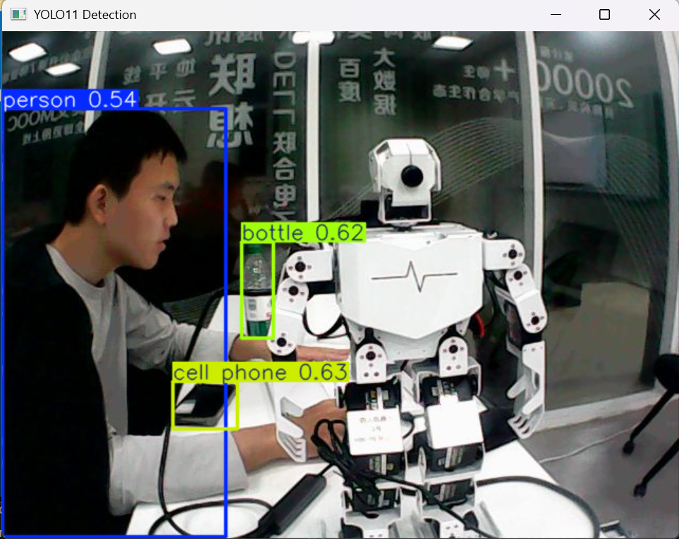
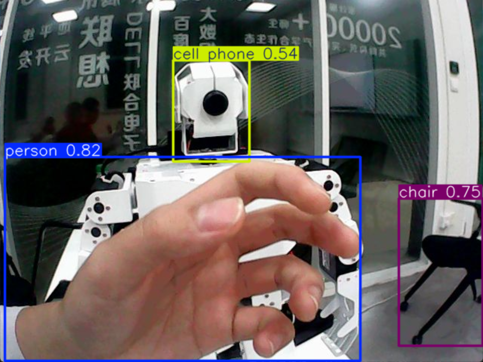

# 第六周：机器人AI模块

## 一、YOLO目标检测

### 1.传感器
-将机器人连接头部的摄像头以传输视频源至电脑。

### 2.代码部分

```python
# server
import cv2
import socket
import struct

# 创建 socket
server_socket = socket.socket(socket.AF_INET, socket.SOCK_STREAM)
server_socket.setsockopt(socket.SOL_SOCKET, socket.SO_REUSEADDR, 1)
server_socket.bind(("0.0.0.0", 8888))  # 监听所有网卡的 8888 端口
server_socket.listen(1)

print("等待客户端连接...")
conn, addr = server_socket.accept()
print("客户端已连接：", addr)

cap = cv2.VideoCapture(0)  # 读取摄像头（0）或视频文件

while cap.isOpened():
    ret, frame = cap.read()
    if not ret:
        break

    # 压缩为 JPG
    ret, buffer = cv2.imencode(".jpg", frame, [int(cv2.IMWRITE_JPEG_QUALITY), 80])
    data = buffer.tobytes()

    # 先发送长度，再发送数据
    conn.sendall(struct.pack(">I", len(data)) + data)

cap.release()
conn.close()
server_socket.close()
```

```python
# client
import sys
import os

import cv2
from ultralytics import YOLO

current_file = os.path.abspath(__file__)
project_root = os.path.dirname(os.path.dirname(os.path.dirname(current_file)))
sys.path.insert(0, project_root)

from src.utils.video_stream import get_frame

if __name__ == "__main__":

    model = YOLO("yolo11n.pt")
    model.to("cuda")
    for frame in get_frame(ip="192.168.137.71", port=8888):
        if cv2.waitKey(1) & 0xFF == ord("q"):
            break
        results = model(frame, stream=True, conf=0.5)  # conf 设置置信度阈值
        for result in results:
            annotated_frame = result.plot()
            cv2.imshow("YOLO11 Detection", annotated_frame)
```

### 3.功能实现
-该程序能调用yolo的目标检测，实时匹配视频中的物体类型。
  
  


## 二、自问自答

### Q1: yolo所用的目标检测原理是什么？
**A1:**  
#### 核心思想
YOLO（You Only Look Once）是一种单阶段目标检测算法，其核心思想是将目标检测任务转化为一个回归问题，通过单次前向传播直接预测图像中所有目标的位置和类别，实现端到端的检测。

#### 工作原理

##### 1. 图像网格划分
YOLO首先将输入图像划分为S×S个网格（如7×7或13×13），每个网格负责检测中心点落入该区域的目标。这种设计让每个网格独立预测目标，避免了重复检测。

##### 2. 边界框预测
每个网格预测B个边界框（通常为2-3个），每个边界框包含5个参数：
- 中心坐标(x,y)：相对于网格左上角的偏移量
- 宽高(w,h)：相对于整个图像的比例
- 置信度(confidence)：表示边界框包含目标的概率和定位准确性

##### 3. 类别预测
每个网格还预测C个类别的条件概率，表示该网格中目标属于各个类别的可能性。最终每个边界框的类别置信度由置信度与类别概率相乘得到。

##### 4. 非极大值抑制(NMS)
由于会生成大量重叠的边界框，YOLO使用NMS算法去除冗余框：首先按置信度排序，然后去除与高置信度框重叠度较高的框，只保留最准确的预测结果。

#### 网络结构特点

##### 单阶段设计
与两阶段算法（如Faster R-CNN）不同，YOLO无需先生成候选区域再分类，而是直接回归预测，这使得检测速度极快，适合实时应用。

##### 多尺度预测
YOLOv3及后续版本采用多尺度特征图（如13×13、26×26、52×52），分别检测大、中、小目标，提升了对不同尺寸目标的检测能力。

##### 端到端训练
整个网络可以端到端训练，损失函数包含三部分：边界框坐标误差、置信度误差和分类误差，通过梯度下降优化所有参数。

#### 优势与局限

优势：
- 检测速度快，可达实时处理（45-140 FPS）
- 结构简单，易于部署
- 全局信息利用充分，减少背景误检

局限：
- 对小目标和密集目标检测精度相对较低
- 定位精度不如两阶段算法精细

#### 应用场景

YOLO凭借其高速特性，广泛应用于自动驾驶、视频监控、无人机目标跟踪等对实时性要求较高的场景。

---

### Q2: AI相关的MCP是什么？有什么用？
**A2:**  
#### 概述
MCP（Model Context Protocol，模型上下文协议）是由Anthropic公司于2024年11月推出的开放标准协议，旨在标准化大型语言模型（LLM）与外部数据源和工具之间的交互方式。它被形象地比喻为"AI应用的USB-C接口"，通过统一的协议让AI模型能够安全、高效地访问文件系统、数据库、API等各种外部资源。

#### MCP的核心架构

MCP采用客户端-服务器架构，包含三个核心组件：

-MCP Host（主机）：运行LLM应用的宿主程序，如Claude Desktop、IDE插件等，是用户直接交互的界面。

-MCP Client（客户端）：位于主机内部，与每个MCP服务器保持一对一连接，负责协议握手、能力发现和具体通信，将服务器提供的数据或功能转交给LLM使用。

-MCP Server（服务器）：独立运行的轻量级程序，通过标准化协议对外提供特定能力或数据，如文件系统访问、数据库查询、API调用等。每个服务器通常封装一种数据源或工具。

#### MCP的核心功能

MCP服务器向客户端提供三类关键要素：

-Tools（工具）：由模型触发调用的函数接口，相当于LLM可用的动作或操作，如调用天气API、创建文件、发送指令等。

-Resources（资源）：由服务器提供的可读数据内容，如文件内容、数据库记录、API查询结果等，通常不产生副作用。

-Prompts（提示词模板）：预先定义的提示词或模板，用于帮助模型更好地利用特定的工具或资源。

#### MCP的主要作用

1. 解决集成碎片化问题
传统模式下，将AI模型接入多个数据源需要为每个数据源编写单独的插件或API调用代码，形成"M×N集成难题"。MCP将其简化为"M+N"问题，工具提供者只需为每种数据源实现1个MCP服务器，应用开发者只需为每个AI应用实现1个MCP客户端。

2. 实现跨模型协作
MCP为多模型协作提供了共享上下文的机制。不同模型或AI智能体都可以通过同样的协议访问同一批数据源，消除信息不对称，实现跨模型的一致数据视图。

3. 提升开发效率
通过标准化接口，开发者无需为每个数据源单独开发复杂的接口代码，大幅降低了开发成本和维护负担。MCP支持动态能力更新，当服务器功能发生变化时，客户端无需重写或重新部署代码。

4. 增强安全性
MCP内置了对认证和使用策略的支持，确保AI大模型只能访问被授权的数据，并以规范格式交换信息。支持OAuth 2.1认证、数据加密和权限分级等多种安全机制。

5. 支持实时数据访问
MCP允许AI模型动态获取实时数据，解决传统模型依赖固定训练数据的局限性。例如，AI助手可以通过MCP在0.5秒内获取文件列表，效率提升10倍。

#### 应用场景

MCP已广泛应用于多个领域：

-软件开发：通过MCP连接代码仓库、GitHub等工具，实现代码自动补全、错误检测、代码审查等功能。

-企业自动化：连接CRM系统、项目管理平台等业务工具，实现自动化任务处理。

-智能客服：通过MCP连接客服系统、知识库、用户数据等资源，提供个性化、高效的客户服务。

-数据分析：连接数据库、数据仓库、API接口等，进行数据清洗、数据可视化、数据挖掘等工作。

-智能家居：通过MCP实现语音控制家居设备、个性化场景设置等功能。

#### 与传统Function Calling的区别

与Function Calling相比，MCP具有明显优势：Function Calling是厂商私有协议，不同LLM平台的实现差异较大，而MCP提供了开放标准，任何支持MCP的模型都可以灵活切换。MCP还支持动态工具发现机制，使Agent能够在运行时灵活获取可用的工具列表。

MCP的出现标志着AI应用开发进入了一个新的阶段，它通过标准化协议解决了AI模型与外部世界交互的核心难题，为构建更加智能、高效和开放的AI应用生态奠定了基础。

---

### Q3:目前LLM大语言模型都有哪些？各有什么突出特点？
**A3:**  
#### 国际主流模型

##### 1. GPT系列（OpenAI）
**最新版本**：GPT-5
**核心特点**：
- **强大的文本理解与生成能力**：作为最早掀起生成式AI浪潮的旗舰模型，在自然语言处理任务中表现卓越
- **多模态输入输出**：支持文本、音频、图像等多种模态，适用于复杂工作流程
- **庞大集成生态**：集成到微软Copilot及多种第三方工具中，应用最广泛
- **混合推理架构**：结合"快思考"和"慢思考"机制，简单任务快速作答，复杂问题深度分析

**优势**：跨多种使用场景的高适应性，强大的推理能力与高准确率，多模态能力突出
**劣势**：相较开源模型定制性较弱，成本高于开源模型

##### 2. Claude系列（Anthropic）
**最新版本**：Claude Opus 4.1
**核心特点**：
- **超大上下文窗口**：支持100万令牌，能够一次性分析大型报告、代码库或整本书
- **宪法AI框架**：强调"安全、可控、对人类有益"的设计宗旨，确保模型行为安全可靠
- **长文本处理**：在推理、代码及长文本任务上表现优异
- **稳健对话管理**：擅长遵循指令与角色边界，拒绝不当请求能力强

**优势**：超大上下文窗口，安全性高，适合受监管行业应用
**劣势**：可能拒绝处理边界或灰色地带查询，响应速度较慢，定制化受限

##### 3. Gemini系列（Google DeepMind）
**最新版本**：Gemini 2.5系列
**核心特点**：
- **原生多模态架构**：从设计之初就采用多模态架构，能够无缝理解和生成文本、代码、音频、图像和视频内容
- **跨格式处理能力**：可通过同一条指令处理多种输入类型，成为应对复杂跨领域任务的全能型语言模型
- **大规模文档分析**：能够处理大型工作流，在单次会话中分析或搜索整个数据库和文档档案
- **Google生态集成**：直接集成到Google Workspace工具中

**优势**：原生多模态能力，跨格式处理，与Google生态深度集成
**劣势**：对幻觉和知识空白较为敏感，需要额外安全措施

##### 4. Llama系列（Meta AI）
**最新版本**：Llama 4系列
**核心特点**：
- **开源可商用**：采用Apache 2.0开源协议，是全球社区二次创作与学术研究的"母机"
- **混合专家架构**：采用MoE架构，总参数达6710亿，但每次推理仅激活370亿参数，降低计算需求
- **多语言支持**：支持12种语言，预训练数据覆盖200种语言
- **长上下文支持**：支持128K tokens的超长上下文窗口

**优势**：完全开源，成本效益高，社区生态丰富
**劣势**：在某些复杂推理任务上性能略逊于闭源旗舰模型

##### 5. Mistral系列（Mistral AI）
**最新版本**：Mistral Large
**核心特点**：
- **小体积高性能**：7B参数版本在多项基准测试中表现优于Llama 2 13B，推理效率更高
- **滑动窗口注意力**：仅缓存局部注意力，降低显存占用，同时支持长上下文
- **量化友好**：支持GGUF格式量化，可在消费级硬件运行
- **混合专家架构**：Mixtral 8x7B采用MoE架构，总参数量45B，但计算消耗类似12B密集模型

**优势**：参数效率高，推理成本低，适合本地部署
**劣势**：参数规模相对较小，在复杂任务上可能受限

##### 6. Grok（xAI）
**最新版本**：Grok 4
**核心特点**：
- **实时数据接入**：实时接入𝕏（原Twitter）数据，擅长回答尖锐问题
- **独特风格**：被马斯克形容为"带着幽默感与叛逆精神的AI"
- **科学发现导向**：旨在用AI加速人类科学发现，为特斯拉、SpaceX等业务提供底层模型

**优势**：实时数据能力，独特个性风格
**劣势**：应用场景相对特定，通用性略逊

#### 国内主流模型

##### 7. DeepSeek系列（深度求索）
**最新版本**：DeepSeek R1、DeepSeek V3
**核心特点**：
- **高性价比**：以高性价比、超长上下文及数学推理见长，训练成本远低于行业标准
- **纯强化学习训练**：通过纯RL训练推理能力，避免对大量人工标注数据的依赖
- **混合专家架构**：DeepSeek-V3采用MoE架构，总参数达6710亿，每次推理仅激活370亿参数
- **开源免费**：采用MIT许可协议，支持免费商用、修改及二次开发

**优势**：成本效益极高，数学推理能力强，完全开源
**劣势**：在某些多模态任务上能力相对有限

##### 8. 通义千问（阿里巴巴）
**最新版本**：Qwen 3系列
**核心特点**：
- **全尺寸覆盖**：覆盖0.5B~110B全尺寸，中英文双语表现均衡
- **多语言支持**：支持119种语言，展现强大的跨语言处理能力
- **开源生态**：衍生模型数量突破10万，是全球最大的开源模型族群
- **混合推理模型**：将"快思考"与"慢思考"集成于一体，能根据任务复杂度动态调整计算资源

**优势**：参数规模全面，多语言能力强，开源生态丰富
**劣势**：在某些特定领域可能不如专用模型

##### 9. 文心一言（百度）
**最新版本**：文心大模型4.5 Turbo
**核心特点**：
- **知识增强**：基于百度在搜索、知识图谱上的积累，中文知识问答准确率行业领先
- **多模态生成**：能够处理文本、图像、音频等多种模态信息，生成多模态内容
- **检索增强**：通过引入搜索结果，为模型提供时效性强、准确率高的参考信息
- **对话增强**：具备记忆机制、上下文理解和对话规划能力

**优势**：中文理解能力强，知识检索能力突出，多模态生成优秀
**劣势**：在某些国际基准测试中表现略逊于国际顶级模型

##### 10. GLM系列（智谱AI）
**最新版本**：GLM-4.5
**核心特点**：
- **双语预训练框架**：是国内最早开源的双语预训练框架之一
- **推理速度优化**：在推理速度、工具调用与智能体能力上大幅提升
- **多语言能力**：支持中英双语对话，在中文理解、公文写作、古诗词处理上表现突出
- **企业级应用**：已服务20余个行业、上万家政企客户

**优势**：双语能力均衡，企业应用经验丰富，推理速度快
**劣势**：参数规模相对较小，在某些复杂任务上可能受限

#### 总结对比

| 模型系列 | 开发者 | 最新版本 | 核心优势 | 适用场景 |
|---------|--------|---------|---------|---------|
| GPT | OpenAI | GPT-5 | 多模态能力、生态集成 | 通用对话、复杂推理 |
| Claude | Anthropic | Claude Opus 4.1 | 长上下文、安全性 | 企业合规、长文档处理 |
| Gemini | Google | Gemini 2.5 | 原生多模态、跨格式处理 | 多模态任务、Google生态 |
| Llama | Meta | Llama 4 | 开源可商用、社区生态 | 学术研究、企业定制 |
| Mistral | Mistral AI | Mistral Large | 参数效率高、推理成本低 | 本地部署、轻量级应用 |
| DeepSeek | 深度求索 | DeepSeek V3 | 高性价比、数学推理强 | 成本敏感场景、数学任务 |
| 通义千问 | 阿里巴巴 | Qwen 3 | 多语言支持、开源生态 | 跨语言应用、开发者社区 |
| 文心一言 | 百度 | 文心4.5 Turbo | 中文理解、知识检索 | 中文场景、知识问答 |
| GLM | 智谱AI | GLM-4.5 | 双语能力、企业应用 | 企业级部署、双语任务 |

**选择建议**：
- **企业级应用**：优先考虑Claude、文心一言、GLM，注重安全性和企业合规
- **开发者社区**：推荐Llama、Mistral、通义千问，开源生态丰富
- **成本敏感场景**：DeepSeek、Mistral提供高性价比选择
- **多模态任务**：Gemini、GPT在多模态能力上领先
- **中文场景**：文心一言、通义千问、GLM在中文理解上表现突出